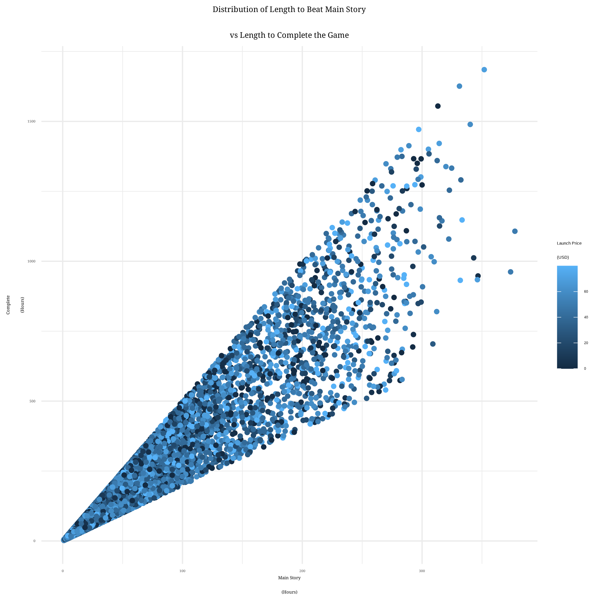
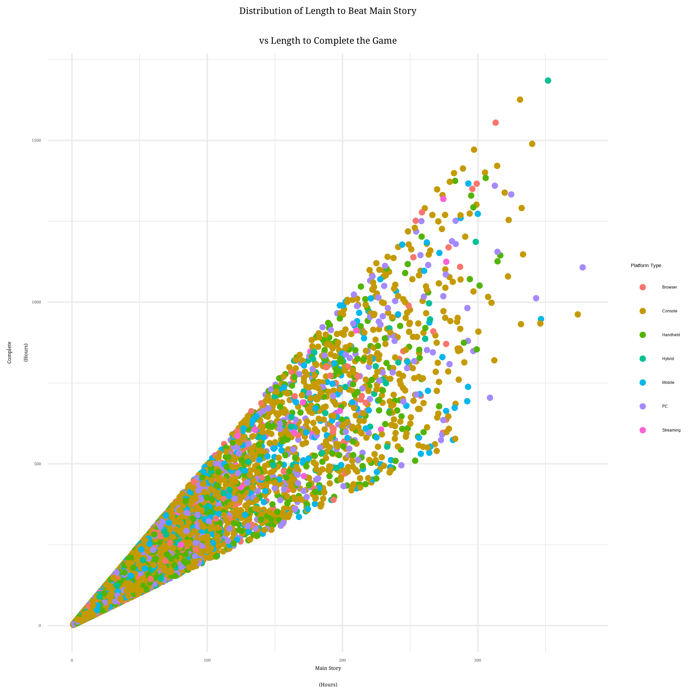
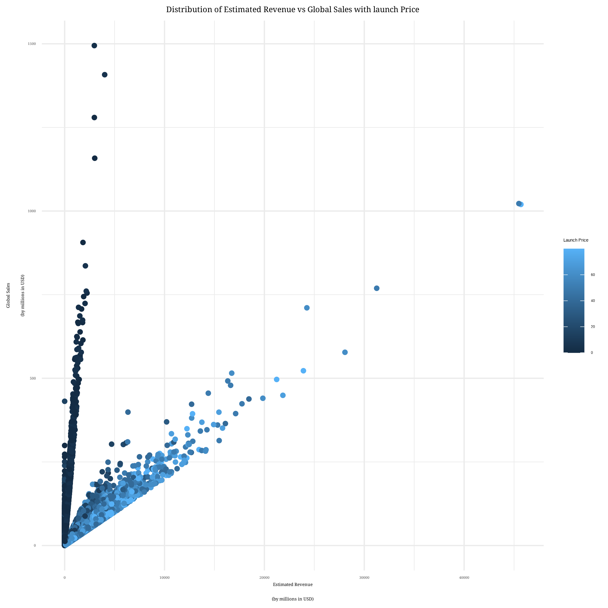
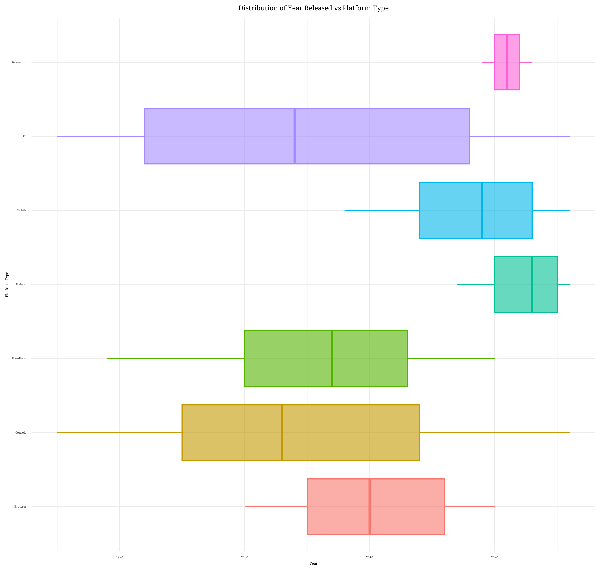
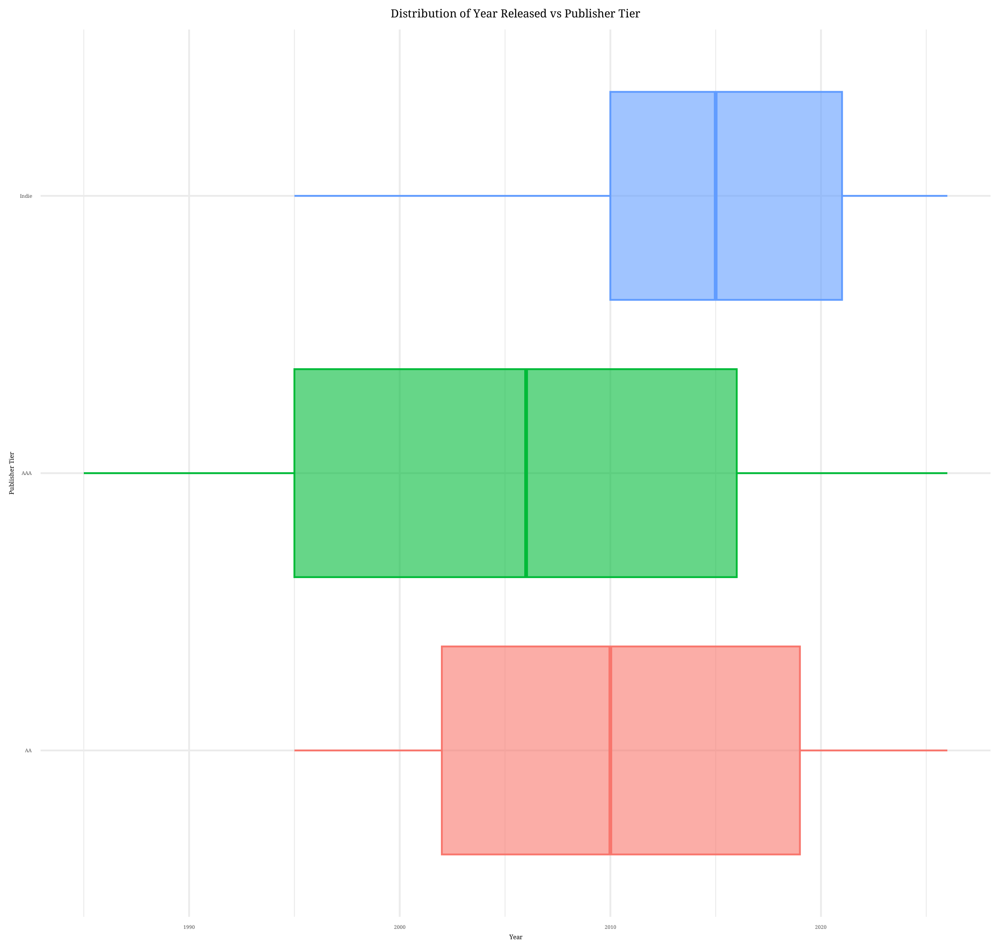
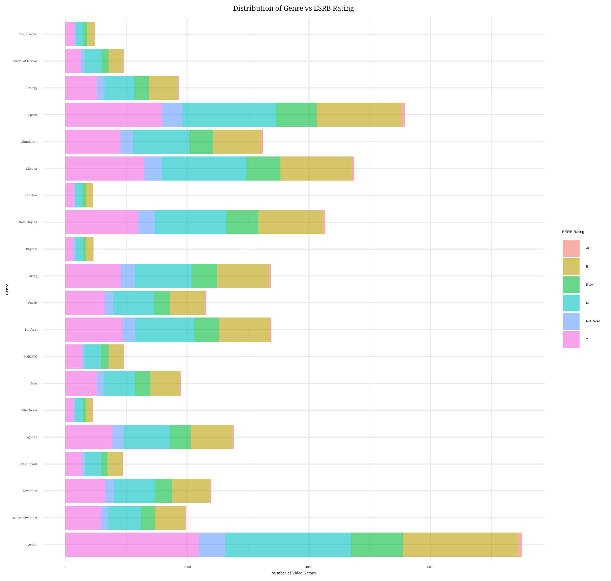
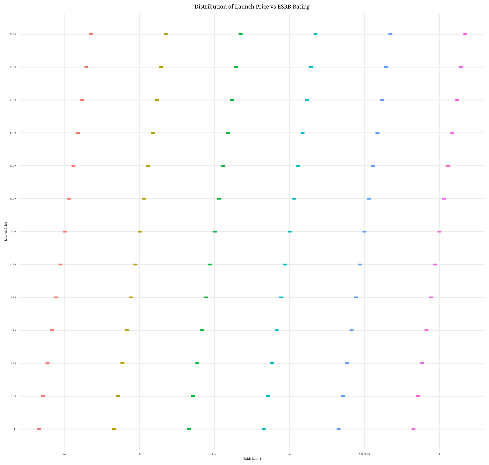

::: {.callout-tip icon=false}

## Github Repo Link

[Github Repo Link](https://github.com/amavila7/Video_Game_Analysis.git)

:::

## Overview

This is a summer project to showcase my skills. The goal is to explore a data set of interest, which in this case would be about video games since 1980's, as well as answer a few of my own research questions. I do some data tidying, a decent bit of exploratory data analysis, and finally, building predictive models. 

```{r}
#| label: libs
#| echo: false

library(tidyverse)
library(here)

games <- read_csv("data/games.csv")

games_cleaned <- read_csv("data/games_cleaned.csv")

```


# Data & Research Questions

## About the Data

The dataset is called `games.csv`and it is from Kaggle.^[] The data includes `50,000` video game records of the past 47 years of gaming history across 33 different platforms, 51 publishers, and 20 genres. It also includes regional sales, ratings, and some engineering columns. This is according to the Kaggle overview for this dataset. This dataset gets updated annually by Meruva Kodanda Suraj. He is a datasets expert with several badges, datasets, and competitions connected to his Kaggle account. 

## Quality Check

Below in the first data summary of the `games` data. There are `50,000` video games, `35` variables, `11` of which are character and the remaining `24` are numeric. However, I noticed most of the numeric and character variables would be more insightful as factor variables. It is also worth noting how there is no missing information for any of the variables. As shown in the second data summary, I made `platform`, `platform_type`, `platform_maker`, `genre`, `publisher_region`, `publisher_tier`, `esrb_rating`, `is_sequel`, `online_multiplayer`, `dlc_released`, `microtransactions`, `loot_boxes`, `game_pass_available`, `vr_support`, `goty_nominated`, and `goty_nominated` to factors.

```{r}
#| label: summary
#| fig-cap: "Summary"
#| echo: false

skimr::skim(games)
```

```{r}
#| label: summary-2
#| fig-cap: "Summary-2"
#| echo: false

skimr::skim(games_cleaned)
```


## Research Questions

### Inferential 

Do certain genres sell more than others?

Do multiplayer games increase sales?

How does microtransactions in a video game impact sales and launch price?

### Prediction

What features or characteristics of a game are most likely to win Game of the Year?

Which traits of a video game go into defining the launch price of the video game?


# Analysis

**Do certain genres sell more than others?**

As we see in @fig-g-w-lp, every genre contains the whole range of launch prices which is `$0` (free) to `$79.99`. The different amount of games per range group of launch price for each genre are due to the difference in amount of games released per genre. With such a large imbalance of games per genre, it is difficult to decipher which genre of game is the most expense. Though it is worth noting how the majority of the games overall, tend to cost money. Another visual of launch price in relation to genre is @fig-lp-g, where the spread of launch price for all the genres is easier to compare. The majority of the genres' launch prices tend to be centered around `$40`, or `$50`. The spreads for all the genres appear pretty similar aside from `Rhythm` which has its middle `50%` on the higher end despite the median being `$40`. However, the range of prices does show how despite having a difference for location of the middle `50%` for `Rhythm` games, its worth noting how the overall range still covers the full range of launch prices. This means that few `Rhythm` games fall on the cheaper end of the launch price range (`$0-$30`). 

Although launch price is helpful for gauging how much the game costs, prices do vary overtime. Therefore, to find the genre that sells the most, I looked at global sales Starting with global sales, @fig-gs-g, shows how even genres with more games don't always have the most sales. For instance, there are more games under `Action` (7,496) than under `Sports` (5,571), however, games under `Sports` tend to make more sales. In fact, `Sandbox` games appear to have a greater median for global sales than any other genre. `Visual Novel` is the genre with the lowest median and least spread for global sales. 

Another aspect I wanted to explore was when the games for the genres came out. In the case that if different genres weren't seen in games since the very beginning then I that would add to my understanding of the global sales differences. Therefore, @fig-y-g shows the distribution of genres in video games, over the years. The time frame ranges from `1885` to `2026`. As we can see, all the genres have existed throughout the whole time frame, but the majority of the games were released between the late `1990s` to late `2010s`. I will say I am a bit more shocked since the pandemic hit during the `2020s` and the gaming community blew up. However, with more of the restraints of working, it makes sense that not as many games were developed around this time. 


{#fig-g-w-lp}

{#fig-gs-g}

{#fig-lp-g}


{#fig-y-g}


**Do online multiplayer games increase sales?**

While gaming solo can be fun, gaming with friends or others online can be more entertaining and even increase sales. As seen in @fig-gs-m, online multiplayers tend to have more sales globally than no online multiplayer games. Although, this preference may not be the same for all part of the world. For insatnce, when taking a deeper dive into the sales in Europe with @fig-eus-m, we see how the middle `50%` of the European sales for online and not online multiplayer games are much closer to each other, and a no online multiplayer games made more sales than the online multiplayer games. This contradicts the conclusion made for the global sales. Whereas the sales in Japan and North America as seen in @fig-jps-m and @fig-nas-m show a similar story to global sales where online multiplayer games tend to sell more. As for sales elsewhere in the world, @fig-os-m shows how this pattern of online multiplayer games tend to sell more than non-online multiplayer games. 

Clearly whether or not the game is an online multiplayer, the games tend to sell pretty evenly when it comes to sales. However, online multiplayer games tend to have more sales overall. Therefore, online multiplayer as a feature for video games does tend to sell more.


{#fig-gs-m}


{#fig-eus-m}


{#fig-jps-m}


{#fig-nas-m}


{#fig-os-m}

**How do microtransactions in a video game impact sales and launch price?**

Microtransactions may seem like an opportunity for players who enjoy pay-to-win games or even games that have a store for extra features. However, microtransactions are usually optional in games, it just might hinder the experience depending on what the player gets in return. Although microtransactions from the company's side is another way to boost sales, especially for free games. Therefore, when looking at global sales for games and whether or not the game has microtransactions, @fig-gs-micro, shows how the sales for games with microtransactions is greater than those without. Although it is worth noting that the overall spread of sales among the games with and without the microtransactions do have similar spreads. The same conclusion can be drawn for specific continents as well, as seen in @fig-eus-micro, @fig-jps-micro, and @fig-nas-micro.

As for launch prices, most of the microtransactions tend to go with the games that have a launch price of `$20+`, and the games that are free. This isn't too shocking since microtransactions can contribute to the sales of the video game on the business side, especially for the games that are launched as free. Although it is worth noting that the majority of the games don't have microtransactions. 


{#fig-gs-micro}


{#fig-eus-micro}

{#fig-jps-micro}

{#fig-nas-micro}


{#fig-lp-micro}


**What features or characteristics of a game are most likely to win Game of the Year?**

**Which traits of a video game go into defining the launch price of the video game?**


# Additional Insight

{#fig-all}


{#fig-main-comp-lp}

{#fig-main-comp-plt}
{#fig-esti-gs-lp}
{#fig-}
{#fig-}
{#fig-}
{#fig-}
{#fig-}


# Reflection

- I wish the month was recorded in the data set
- I wish online was separated from multiplayer
- It would be nice if how many players allowed per game (1,2,3,4, etc)

## References

GeeksforGeeks. “Bootstrap Method.” GeeksforGeeks, July 23, 2025.  

[GeeksforGeeks](https://www.geeksforgeeks.org/maths/bootstrap-method/) was really helpful for conceptually understanding the bootstrap method. It provided clear mini examples of the process.
